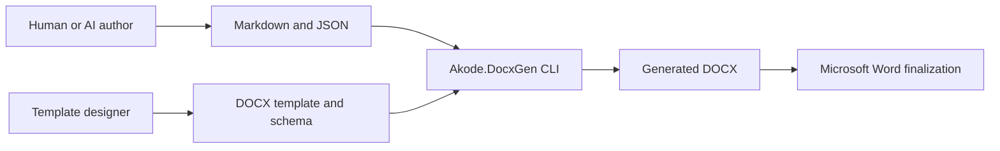
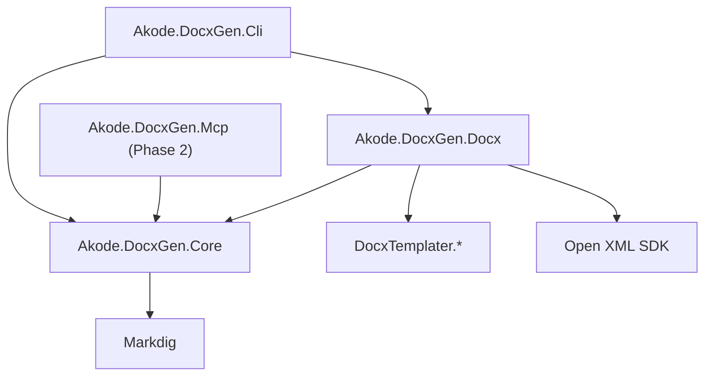
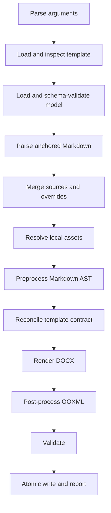
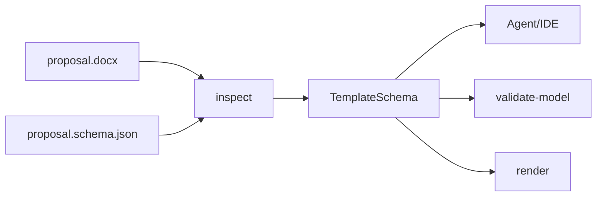

# Architecture

## System context



The author owns content and metadata. The template designer owns branded
styles, fixed artwork, fields, sections, headers, footers, and cover pages.
DocxGen joins the two without invoking an LLM or Word.

## Container boundaries



### Core

Owns domain-level behavior:

- model contracts and parsing;
- base/template schema validation;
- Markdown preprocessing and anchored sections;
- merge precedence;
- security and limits;
- diagnostics;
- render orchestration abstractions.

Core has no knowledge of DOCX package types or command-line parsing.

### Docx

Owns the document technology adapter:

- DocxTemplater rendering;
- formatter registration;
- template package inspection;
- ordered Open XML post-processing;
- Open XML validation;
- normalized golden-test helpers.

### CLI

Owns process behavior:

- `System.CommandLine` definitions;
- file and stdin handling;
- dependency injection;
- cancellation;
- stdout/stderr separation;
- atomic output;
- exit-code mapping.

### MCP

Phase 2 exposes typed wrappers over Core. It must not call CLI handlers or
duplicate pipeline logic.

## Pipeline



Each stage returns diagnostics instead of writing to the console. Strict mode
stops before rendering when required data is missing or of the wrong kind.

## Template and schema relationship

The DOCX is the visual authority. The adjacent JSON Schema is the data-contract
authority. `inspect` bridges them:



The schema stores template id/version and a template hash extension. A hash
mismatch makes the contract stale; the template owner must inspect and review
the regenerated schema.

## Determinism

Runtime timestamps, random relationship identifiers, revision ids, and ZIP
entry ordering may vary even when document semantics are identical. Golden
tests normalize known volatile fields before comparison. Product determinism
means equal normalized inputs produce equal normalized OOXML.

## Error model

Domain stages produce:

```text
code + severity + message + hint + optional path
```

CLI maps the most severe category to a stable exit code. JSON output preserves
all diagnostics in pipeline order.

## Design constraints

- One renderer instance is not used concurrently until thread safety is proven.
- Large Markdown placeholders occupy an entire Word paragraph.
- Inline figures are preferred over floating shapes.
- Word fields are marked for update on open; no layout engine is embedded.
- Optional whole-page furniture uses explicit template variants initially.
- No custom Markdown-to-OOXML engine is started until the P0 spike and a
  superseding ADR justify it.
