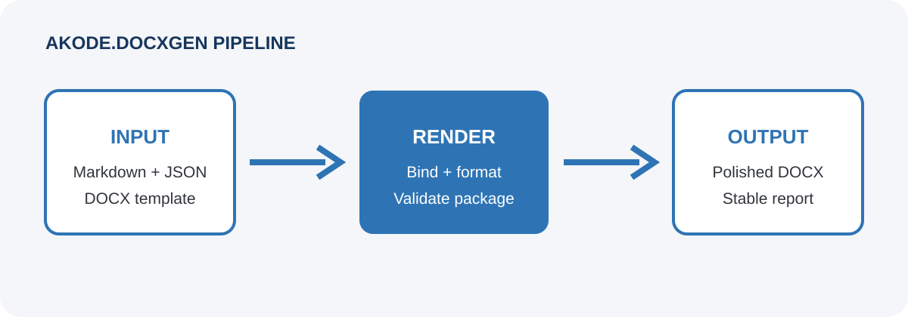

# Executive Summary

This synthetic reference document demonstrates governed DOCX generation from
Markdown and structured metadata. It contains no customer information.

## Objectives

- Keep content versionable in Git.
- Apply branding from a Word template.
- Produce deterministic, valid OOXML.

# Platform Overview

## Architecture

The platform separates structured content, document processing, and the
approved Word design.

## Delivery Approach

1. Discover the document requirements.
2. Confirm the governed template and data contract.
3. Draft and validate the content.
4. Render, review, and approve the final document.

| Stage | Outcome |
|---|---|
| Discovery | Confirmed scope and source material |
| Authoring | Reviewed Markdown and structured metadata |
| Delivery | Validated DOCX ready for approval |

# Assumptions

> The final document is opened in Word once to update its table of contents and
> other fields.
